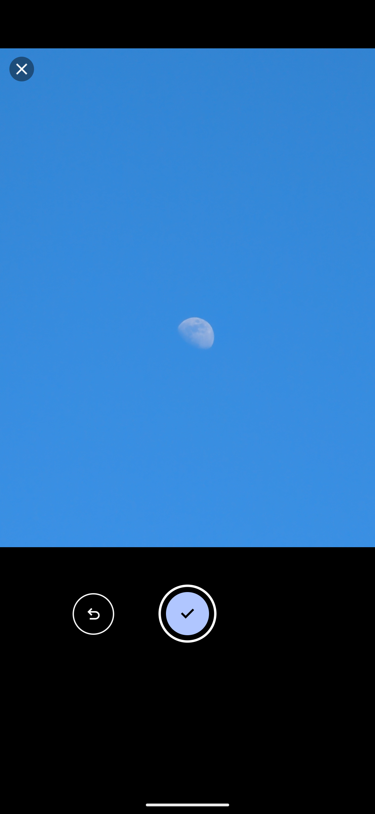

<table>
  <tr>
    <td style="vertical-align: top; padding-right: 16px;">
      
    </td>
    <td style="vertical-align: top;">
      <div style="font-size:2.5em; font-weight:bold; color:#2c3350;">Lunar Log</div>
      <div style="font-style: italic; color:#2c3350; margin-top: 4px;">Daily pictures of the moon</div>
    </td>
  </tr>
</table>

## About

Lunar Log is an Expo-based mobile application for iOS and Android that allows you to take daily pictures of the moon. Check the [motivation](#motivation) if you're interested.

## Screenshots

<p align="center">
  
  
  
</p>


### Features
- Calendar view
- Pick from gallery or take a picture
- Crop the image to focus on the moon
- Mark day as "Not seen"

## Running the App

```bash
expo start
```

- Scan the QR code with Expo Go on your device.
- Or run on simulators:
  - `expo run:ios`
  - `expo run:android`

For deeper customization or standalone builds, see the [Expo Documentation](https://docs.expo.dev).

## Building for Production

We use [EAS](https://docs.expo.dev/build/introduction/) for production builds:

```bash
eas build --platform ios
eas build --platform android
```

You'll need to configure your `eas.json` and have access to your Apple and Google credentials.

## Contributing

Feel free to contribute! If your additions diverge from the motivation, you are free to fork it and keep your own version.

## Motivation

One of my main life philosophies is to learn how to pay attention to mundane things and learn how to get joy and awe out of them. To use mundane things as a reason to be mindful and thankful about our existence, and the moon is a great example of that.

In an age where we use watches to perfectly measure time and calendars to absolutely keep track of our days, we still fail to keep track of something as simple as the moon phases. I realized that I had no idea when the moon was going to be full until it was too late, and perhaps I would even miss it because I either forgot to look at the sky or it was a cloudy day and I wasn't even aware that I was missing a full moon due to the clouds.

Because of that, I wanted to have a more consistent way to keep track of it and potentially collect these attention moments into a very simple app that would only keep the track of a very simple representation of how the moon was that day. The goal is not to be a perfect photographer of the moon; the goal is to maybe ground the moment of attention into a collectible that will help you see the overall appearance of the moon throughout its phases.

My goal is to also expose the days that I forget to look at the moon, or the days that I simply can't because the moon is not showing or is showing very late in the night and leaves very early in the morning, and to also show the days that it is cloudy so I can't see it. The goal of this is not to have a perfect score but is just to increase awareness, and by increasing awareness we create a deeper connection with the cycles of our universe.
